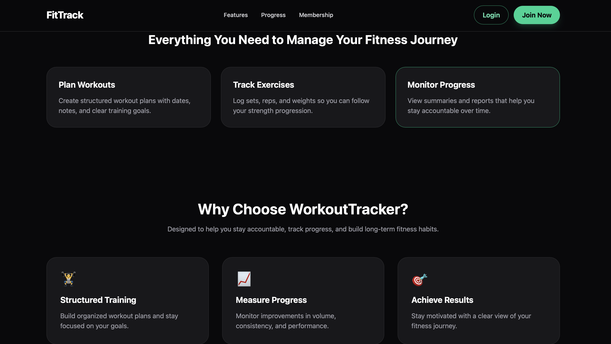
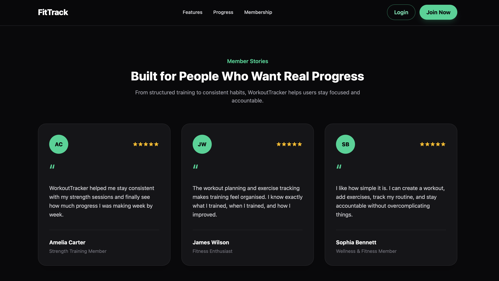
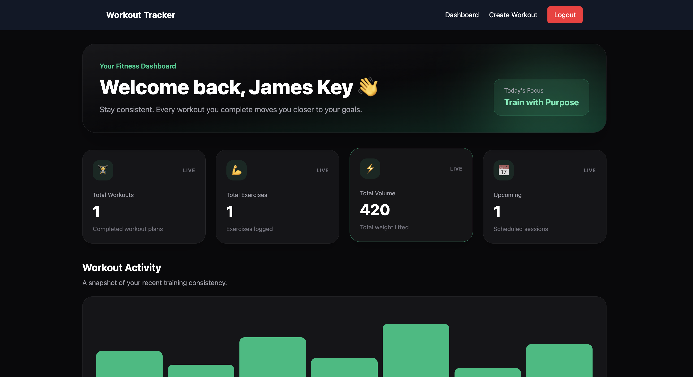
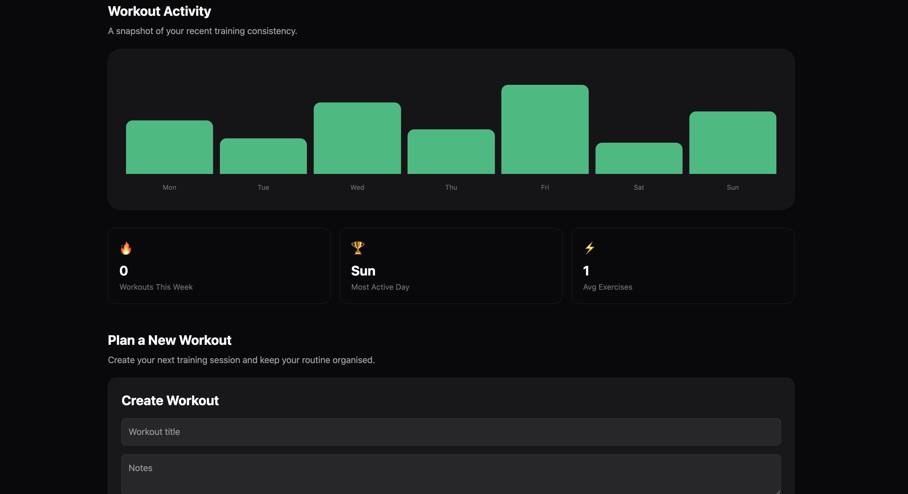
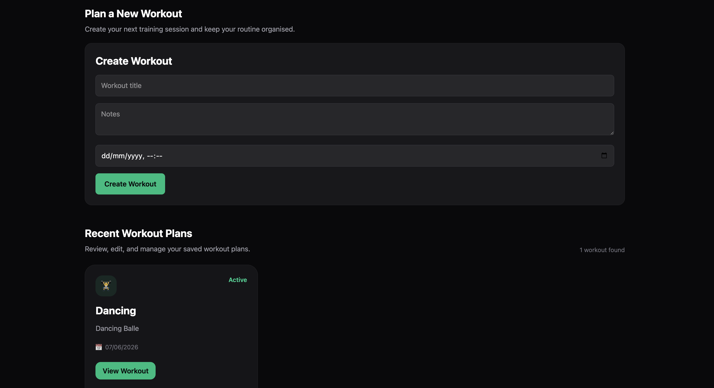

# Workout Tracker

A full-stack fitness tracking application that enables users to create, manage, and monitor workout plans and exercises through a secure and responsive web platform.

## Live Demo

### Frontend

https://workout-tracker-client-seven.vercel.app

### Backend API

https://workout-tracker-api-wwvf.onrender.com

---

## Source Code

### Frontend Repository

https://github.com/austzdee/workout-tracker-client

### Backend Repository

https://github.com/austzdee/WorkoutTrackerApi

---

## Overview

Workout Tracker was built to help users organise and track their fitness routines through a secure and intuitive platform. 

Users can:

* Register and log in securely
* Create workout plans
* Manage exercises
* Track scheduled workouts
* View workout analytics
* Access personalised workout data

The application demonstrates full-stack development using modern technologies including React, TypeScript, ASP.NET Core, JWT Authentication, Entity Framework Core, and PostgreSQL.

The application follows a modern client-server architecture with a React frontend, ASP.NET Core Web API backend, and PostgreSQL database hosted in the cloud using Vercel and Render.

---

## Problem Statement

Many people struggle to maintain consistency in their fitness routines due to a lack of structured workout planning and progress tracking.

Workout Tracker provides a secure platform where users can create workout plans, manage exercises, monitor training schedules, and gain visibility into their fitness activity through dashboard analytics.

---

## Features

### Authentication

* User Registration
* User Login
* JWT Authentication
* Protected Routes

### Workout Management

* Create Workouts
* Update Workouts
* Delete Workouts
* View Workout Details

### Exercise Management

* Create Exercises
* Update Exercises
* Delete Exercises

### Dashboard Analytics

* Total Workouts
* Total Exercises
* Total Volume Lifted
* Upcoming Workouts
* Weekly Workout Insights

---

## Screenshots

### Hero Section


### Features Section


### Information Section



### Testimonials



### Dashboard Overview



### Workout Activity Analytics



### Workout Planning



---

## Tech Stack

### Frontend

* React
* TypeScript
* Vite
* Tailwind CSS
* Axios
* React Router

### Backend

* ASP.NET Core .NET 10
* Entity Framework Core
* JWT Authentication
* BCrypt Password Hashing

### Database

* PostgreSQL

### Deployment

* Vercel
* Render

### Development Tools

* Git
* GitHub
* Postman
* Swagger / OpenAPI

---

## Architecture

```text
React + TypeScript Frontend
            │
            ▼
ASP.NET Core .NET 10 Web API
            │
            ▼
Entity Framework Core
            │
            ▼
PostgreSQL Database
```

---

## Technical Challenges & Solutions

### PostgreSQL Migration

The application initially used SQLite during development and was later migrated to PostgreSQL for production deployment.

Key challenges included:

* Entity Framework provider migration
* Identity column configuration
* Migration regeneration
* PostgreSQL DateTime handling
* Cloud deployment configuration

These issues were resolved through migration recreation, PostgreSQL identity configuration updates, and UTC date standardisation.

### Authentication & Security

JWT authentication was implemented to secure user-specific workout data and protect API endpoints.

---

## What I Learned

Through this project I strengthened my skills in:

* ASP.NET Core Web API development
* React and TypeScript
* JWT Authentication
* PostgreSQL
* Entity Framework Core
* REST API design
* Cloud deployment using Render and Vercel
* Git-based workflows
* Production debugging and troubleshooting

---

## Local Development

### Frontend

```bash
git clone https://github.com/austzdee/workout-tracker-client.git

cd workout-tracker-client

npm install

npm run dev
```

### Backend

```bash
git clone https://github.com/austzdee/WorkoutTrackerApi.git

cd WorkoutTrackerApi

dotnet restore

dotnet run
```

---

## Author

Daniel Onyekachukwu Okafor

GitHub:
https://github.com/austzdee

Portfolio:
https://austzdee.github.io/portfolio-website

Live Application:
https://workout-tracker-client-seven.vercel.app
